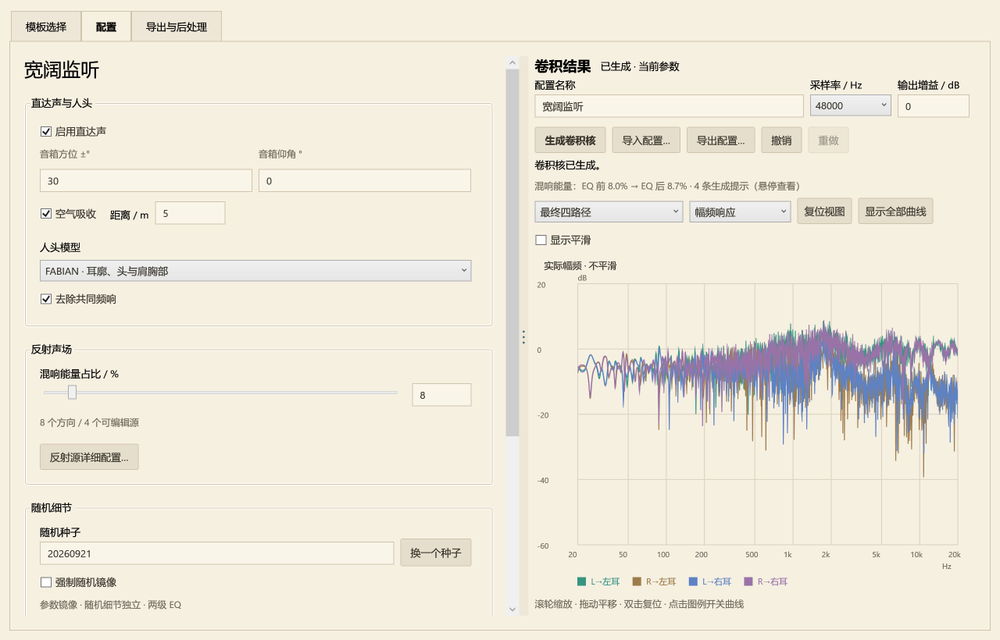
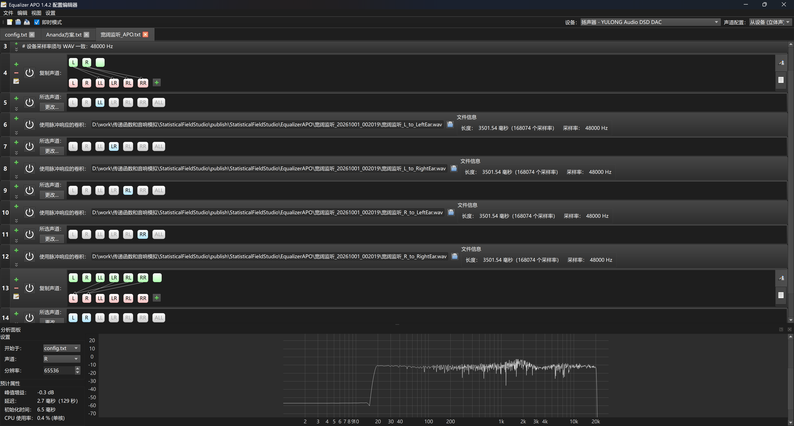

# Statistical Field Studio · 统计声场编辑器

[下载 Windows x64](https://github.com/kunimisena/StatisticalFieldStudio/releases/latest)

## 配合Equalizer APO 使用更佳！
## 作者前言

<!-- AUTHOR_FOREWORD_START -->

这是一个几乎完全由GPT完成的项目，包括但不限于所有的源码，文档，指南等内容。本人仅仅是决定了架构并试听了效果。

项目最初的启发源于EFOtech <https://github.com/Joe0Bloggs/EFOtech_MLV>

我用EFOtech的四条卷积核很多年了，作为重度耳机用户，我不喜欢，也不习惯去聆听在头中的原始声音效果。

耳机作为一个回放系统来说具有独到的优势，但是大部分的双声道音乐相当干，还有左右耳完全不互通的问题。

这是可以理解的。毕竟，人们也许更喜欢听有一点湿的音乐，但是音响回放系统本身是有染色的。对我来说，音响系统是一个双激励源经过染色到达双采样点的问题。而音频文件干也意味着其经过音响的染色后不会出现重复染色的问题——这实际上是正确且方便的，并且也给耳机音效准备了机会。

最初，我想要单纯寻求一个EFOtech的替代方案，以追求更复杂可调的空间效果，并且可能规避掉一些EFOtech卷积核中可能的低频房间结构。

我能找到的大部分空间音效，要么显著改变了EQ，要么比较追求还原某一个具体的房间，而具有显著的房间结构。这两者我都不喜欢。

起初我尝试做一个用随机反射点模拟的椭球空间之类的方案，但是听感很奇怪，并且这些反射点对于不同频率应该怎么响应还不好确定。如果要做类似光追的“声追”，显然又太复杂。

在反复尝试并微调后，我放弃了用随机反射点的想法。但结合我在椭球空间随机反射点算出的卷积核的听感，我想到了我到底想做什么。

实际上，我只想要做三件事情：

1. 我要人头，肩膀胸部，耳廓的效应，我要音响在正负30度的人头响应。
2. 我要混响，湿一点的声音，但是我**不要**房间结构。
3. 我要中性的，因果的响应，不要改变我的耳机频响，也不要改变总响度。

从这三点出发，Astra和5.6sol的帮助下诞生了这个生成卷积核的小工具。

第一件事情，我利用了FABIAN的人头响应（也有一个球形头，但是效果我不满意。FABIAN的，应该是模型的耳廓响应部分，带来了极好的效果）。我直接选择在人头附近放置少数扩散反射源——这并不要紧，人耳只有两个采样点，你想要解AoA模糊这并不可能（笑）

第二件事情，由于不要房间结构的需求，我选择完全不追求早期反射的具体反射点，相位/延时关系，也完全不要低频驻波。相对的，直接用一些高斯噪声，在控制总能量，频谱能量，频谱衰减时间，反射建立时间的条件下，用一定组合方式去完成混响卷积核的建立

第三件事情，考虑到响应的因果性和延迟，直接用平滑+最小相位EQ把卷积核的响应拉平，能量归一化。

这样，开启或者关闭音效，并不影响回放设备的频响以及总响度。当然，由于声道数量的限制，左右声道单独校准会让中置声道可能坑坑洼洼，因此我加入了独立校准中置声道的强度设置——当然，校准中置声道往往意味着左右声道自己会坑坑洼洼。而且我不喜欢校准中置声道的声音。这是双声道录音的局限性。

总的来说。这个软件做的事情是：

1. 通过混响设置来设置混响反射源
2. 反射源分布在FABIAN的人头的自定义方向上
3. 直达声和反射源混合，形成左声道到左耳，左声道到右耳，右声道到左耳，右声道到右耳的四条卷积核
4. 最小相位EQ两层（中置声道校准默认关闭）校准，保证除了混响和人头响应以外尽量没有任何其他染色
5. 导出最终的卷积核和Equalizer APO配置

享受音乐厅！

最后，AI在文档里面写的东西，尤其是“欢迎什么反馈”里面，请不要全信（笑），我确实无力控制更多。
我让AI检查过有关项目的开源许可，如果侵权，请务必告知。

<!-- AUTHOR_FOREWORD_END -->

---

**给耳机设计一个喜欢的声场，导出卷积核，继续使用自己的耳机 EQ。**

[English](README.en.md) · [使用指南](docs/zh-CN/guide.md) · [设计哲学](docs/zh-CN/design.md) · [构建与仓库](docs/zh-CN/development.md)

这是一个 Windows 离线双耳卷积核编辑器。你可以在头部周围布置虚拟反射方向，为每个方向设计能量频谱和衰减包络，再让音箱直达声和反射声一起经过人头模型。

目标是让耳机立体声更舒展、更好听，并提供自由调校。编辑器组合可调的统计混响、FABIAN 人头响应和可检查的 EQ，输出普通 WAV 卷积文件。

## 能做什么

- 十套声场模板加空白模板；启动时选择宽阔监听。配置可通过 JSON 文件保存和载入。
- 整体或逐方向调整能量频谱、随频率变化的衰减、首反起点、反射变密过程和完整能量包络。
- 切换 FABIAN 头部／耳廓／肩胸部响应与简化球形头；参数镜像与随机细节镜像分别处理。
- 查看实际核的频响、脉冲、能量衰减、相位和群延迟；图例可以单独开关曲线。
- 独立调整一级每耳 EQ 与二级共同 EQ 的强度；二级默认 **0%**。
- 导出 44.1／48／96 kHz 的四条 float32 WAV、四路径打包文件，或 Equalizer APO 配置。
- 可选：把歌曲通过当前卷积矩阵处理，选择响度补偿与限幅。这项功能使用外部 FFmpeg。

## 开始听

1. 从完整 Windows x64 便携文件夹打开 `StatisticalFieldStudio.exe`，无需另外安装 .NET。界面为中文，文档提供中英两版。
2. 点击模板，在弹窗中调整起始参数，选择“确认”或“确认并生成卷积核”。整体曲线在模板窗口编辑；配置页调整人头与 EQ，图表旁生成卷积核，右侧按钮导入或导出 JSON 配置。逐源细调使用独立窗口。
3. 点击“导出与后处理”，导出 WAV、Equalizer APO 配置，或处理歌曲。
4. 通过“导出配置…”保存调好的参数；修改参数后需要重新生成。项目、WAV、APO 和歌曲输出都带模板名称，重名时用序号区分。

*“宽阔监听”配置在 Equalizer APO 中的四路径卷积与声道合成。*

歌曲处理：在“导出与后处理 → 处理歌曲”中点击“选择 ffmpeg.exe…”，选择支持 libsoxr、且同目录有 ffprobe.exe 的完整构建。路径会自动记住，可点击“检查可用性”验证。也支持从程序旁 `tools/ffmpeg/`、系统 PATH 自动查找。公开发布包不附带 FFmpeg；卷积核生成与导出可直接使用。

## 我们想做的事情

以听感为目的，让参数和结果可检查。用平滑的频谱、衰减趋势规定大体特征，用因果的随机核生成细密时频结构；直达声和混响都经过人头。最终是一个固定、可复现的 2×2 线性系统。

宽阔监听是作者推荐的日常起点；控制室提供克制短促的反射，自由场只保留经过人头的直达声。预设还覆盖环绕与大厅等调音起点。每套声场都可以从整体曲线继续深入到单个方向，保存参数后再现同一结果。[设计与信号流程](docs/zh-CN/design.md)。

## 仓库内容

| 目录 | 内容 |
|---|---|
| `App/` | .NET 8 WPF 界面、视图模型和离屏界面检查 |
| `Core/` | 统计合成、人头滤波、EQ、分析和导出 |
| `Core/Data/` | 内嵌 FABIAN 数据、来源、校验值和模板参数 |
| `Tests/` | 控制台验证程序 |
| `docs/` | 中英对照文档和本地 HTML 帮助 |
| `tools/` | 可选的数据转换与打包工具 |
| `publish/` | 本地便携程序与发布压缩包，不进入 Git |

在 Windows 安装 .NET 8 SDK 后运行 `./build.ps1`。常规构建与核心检查不需要 Python、下载 SOFA 或安装 FFmpeg。[构建说明](docs/zh-CN/development.md)。

## 欢迎什么反馈

欢迎电声、DSP 和耳机爱好者交换参数、对比听感、质疑模型。报告时附项目 JSON、人头选择、两级 EQ 强度、混响比例、采样率，以及等响度比较时的变化，会比单纯说“声场大”更有帮助。请不要上传无权分享的歌曲或别人的卷积核。[参与说明](CONTRIBUTING.md)。

## 使用的数据、工具与研究

FABIAN 提供实测人头响应，采用 CC BY 4.0；球形头参考 Brown–Duda 模型，空气吸收参考 ISO 9613-1，统计混响参考自然混响研究。歌曲处理使用 FFmpeg 完成卷积、媒体转换、响度测量与限幅，并通过 libsoxr 重采样。便携程序附带 .NET/WPF 运行时。[完整来源、修改与许可说明](THIRD_PARTY_NOTICES.md)。

## 状态与致谢

程序版本：**4.9.3**。[构建与验收记录](docs/VALIDATION.md)。

项目自有代码与文档采用 [MIT 许可证](LICENSE)：允许使用、修改和再分发，保留版权与许可声明即可。

FABIAN 单独按 CC BY 4.0 保留署名。仓库和分发材料不附带个人项目或实验预设。[第三方资料和研究来源](THIRD_PARTY_NOTICES.md)。
