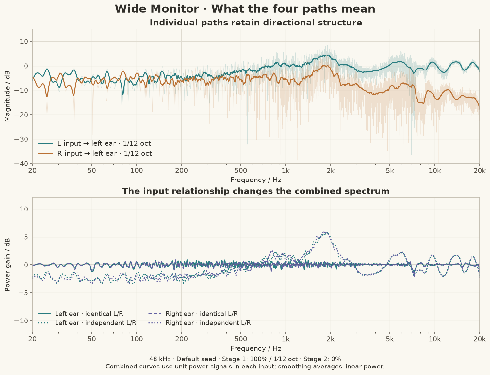
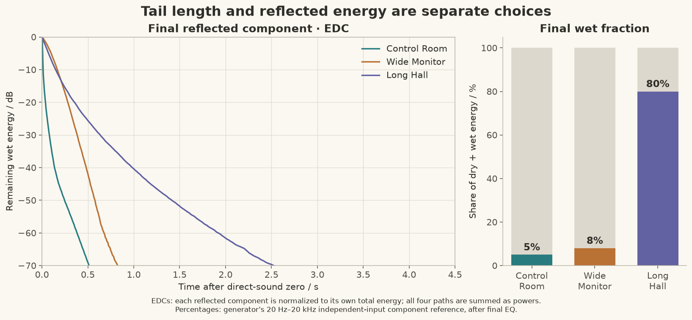
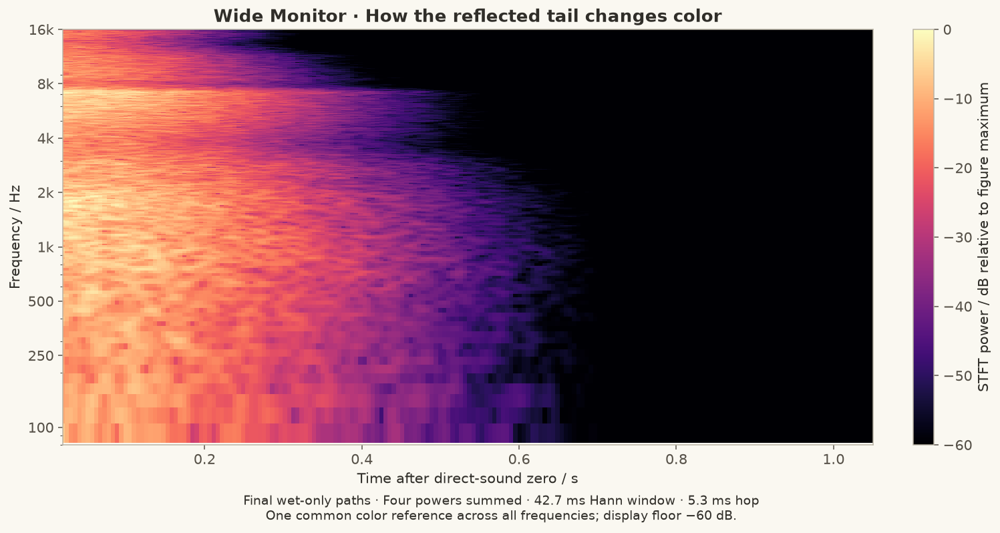

# Reading the kernel plots

[简体中文](../zh-CN/analysis.md) · [Home](../../README.en.md) · [User guide](guide.md) · [Signal model](design.md)

The plots below use actual kernels generated by Soundstage IR Generator 4.13.0. They explain what to compare when tuning a field: directional response, combined tone, reflected energy and decay over time.

All examples use the built-in template parameters, 48 kHz, seed `20260920`, FABIAN with common-response removal, stage-1 correction at 100% with 1/12-octave smoothing, and stage 2 at 0%. The numerical results and file hashes are recorded in [analysis metadata](../images/analysis-metadata.json).

## Individual paths and combined responses

A stereo-to-binaural renderer has four transfer functions. Consider just the left ear: call the L-input path `A(f)` and the R-input path `B(f)`. Its output is `A L + B R`.



The upper panel shows the two final paths feeding the left ear in **Wide Monitor**. Faint lines show unsmoothed FFT magnitudes; strong lines show 1/12-octave power-smoothed curves. The crossed path loses more high-frequency energy, while both paths retain directional structure. A single path is not the reference that stage 1 flattens.

The lower panel compares two input relationships, with unit power in each input:

| Inputs | Left-ear output power |
|---|---|
| Identical, in-phase L and R | `\|A + B\|²` |
| Independent L and R with equal power | `\|A\|² + \|B\|²` |

For identical inputs, phase matters through the cross term. For independent inputs, that cross term averages to zero. These are two different ways to excite the same fixed matrix; the dotted and solid lines need not coincide.

Stage 1 uses the smoothed **identical-input response of each ear**. Its corresponding solid curves sit near the output reference in this example. The independent-input curves have a different contour. Stage 2, if enabled, instead adds a common correction derived from the complex average of the already corrected two ear responses. It does not isolate or extract a musical center source.

In the application, select **Final four paths** to inspect directional paths, or **Final per-ear response to identical inputs** to inspect the combined reference. **Smooth display** changes only the display. The lower panel's independent-input calculation is an additional offline illustration, rather than a separate app plot mode.

A stereo recording's correlation changes across frequency and time. Comparing these references helps explain why EQ strength can alter the tonal balance of one recording differently from another.

## Tail duration and wet fraction



The left panel contains **energy-decay curves (EDCs)** for the final reflected component alone. For each template, squared samples from all four reflected paths are summed, integrated backward from the end, and divided by that template's total reflected energy:

```text
EDC(t) = 10 log10 [remaining reflected energy after t / total reflected energy]
```

Each curve therefore starts at 0 dB even when the actual wet fractions differ. Control Room loses reflected energy quickly; Wide Monitor retains a longer, modest tail; Long Hall sustains a much longer tail. The right panel restores the missing level context: their generator-reported final reflected fractions are 5%, 8% and 80%, respectively.

The bars use the generator's independent-input, 20 Hz–20 kHz, two-ear component-energy reference after EQ. They exclude dry/wet cross terms. They are not percentages of perceived loudness or fractions guaranteed for every song.

### Three different meanings of “long”

| Template | Output file duration | Broadband wet-only T20 extrapolation | Final wet fraction |
|---|---:|---:|---:|
| Control Room | 1.725 s | 0.171 s | 5.00% |
| Wide Monitor | 2.749 s | 0.698 s | 8.00% |
| Long Hall | 8.702 s | 1.259 s | 80.00% |

**Output file duration** includes the synthesis support and very quiet ending of the final filters. **Decay time scale** in the template is a frequency-dependent envelope parameter. **T20 extrapolation** here fits a straight line to the broadband wet EDC between −5 and −25 dB and extrapolates that slope to a 60 dB drop.

The three quantities need not match. A shaped envelope and frequency-dependent tails can change slope over time. For example, a small late component can extend the file while contributing little to total energy. The fitted values above characterize the broadband decay of these particular generated wet components. The fit intervals and goodness-of-fit are included in the metadata.

Use the EDC shape to inspect the whole decline, the envelope editor to change its course, and **Reverberant energy / %** to adjust its weight against direct sound.

## The tail changes color over time



This spectrogram contains only Wide Monitor's final reflected paths. Time is relative to the direct-sound reference. Powers from all four paths are summed, using a 2048-sample Hann window and a 256-sample hop: about 42.7 ms and 5.3 ms at 48 kHz.

The color scale has one common reference across all frequencies. A darker upper-right region means less high-frequency reflected energy remains late in the tail. It is not produced by independently rescaling each frequency row.

Two settings contribute differently:

- The **energy spectrum** sets how much total energy each region receives.
- The **decay time scale** sets how that energy is distributed over time.

Final head processing and EQ further shape the plotted result. Lowering high-frequency energy and shortening its decay can both be useful, but they are separate adjustments: a quiet long high-frequency tail differs from a louder short one. The spectrogram exposes that distinction more clearly than a whole-kernel FFT.

The window averages over tens of milliseconds. Inspect **Impulse response** in the application for the direct peak and the first few milliseconds; this spectrogram is intended for the broader tail.

## Phase and group delay in context

The application's **Unwrapped phase** and **Group delay** plots remove the shared direct-reference lead-in. Individual path delays and the temporal structure of the tail remain.

Read these alongside magnitude and impulse response. A detailed phase curve belongs to a detailed, fixed time-domain kernel. Group delay is a local phase slope; around interference minima it need not represent the arrival time of a separate reflection. For tuning, use the impulse response to locate arrivals, the decay plot to inspect persistence, and the phase/group-delay views to compare the same path between configurations.

The renderer retains the statistical kernel's generated phase structure. Minimum-phase correction describes the EQ filters; the complete reflected tail is not converted into a minimum-phase impulse.

## Figure provenance and reproduction

Source: commit `42c782826e9fd68503345deae77885837203f291` (4.13.0). The screenshots in the guide are offscreen renders of the English and Chinese WPF controls from that source. Template parameters and synthesis code were not changed for the figures.

The analysis reads float32 snapshots of `GenerationResult.Kernels` and `FinalReflectionPaths`; the final path bundle uses the same samples and route order as WAV export. Directional paths and component powers are kept separate throughout the calculations.

| Figure | Calculation |
|---|---|
| Path spectra | Zero-padded FFT to the next power of two; 20 log10 of magnitude; no sample normalization |
| Smoothed spectra | Integrate linear power over `f × 2^(±1/24)`, divide by interval width, then take 10 log10 |
| Combined references | Form complex path sums or sums of path powers before smoothing |
| Wet EDC | Sum squared samples across the four final wet paths, integrate backward, normalize to total wet energy |
| T20 illustration | Least-squares slope over the wet EDC's −5 to −25 dB interval; estimate `−60 / slope` seconds |
| Spectrogram | Four STFT powers summed, one global color reference; displayed from 80 Hz to 16 kHz with a −60 dB floor |

To compare your own settings, save the JSON and keep the seed fixed, regenerate after each parameter change, and inspect the same subject and plot mode. The [user guide](guide.md#read-and-interact-with-the-plots) lists the app's plot subjects and controls.
