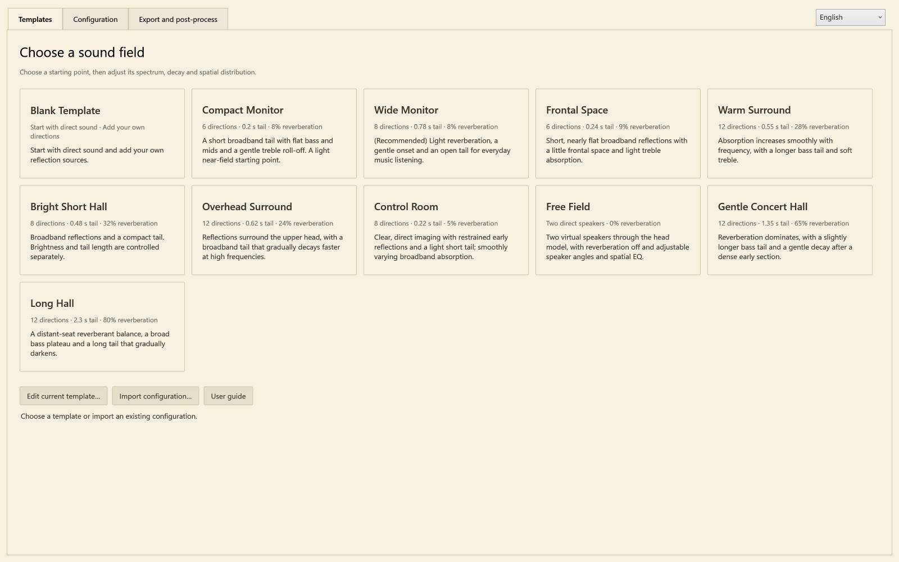
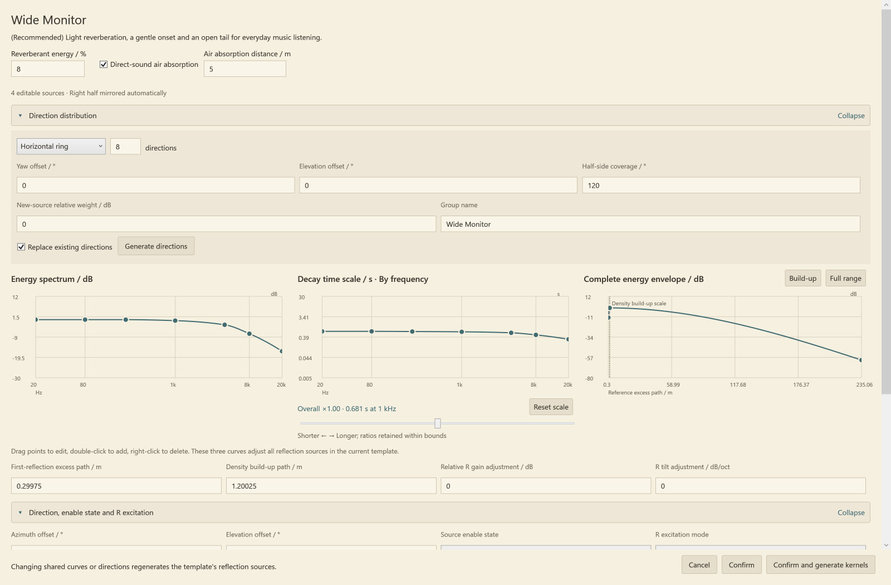
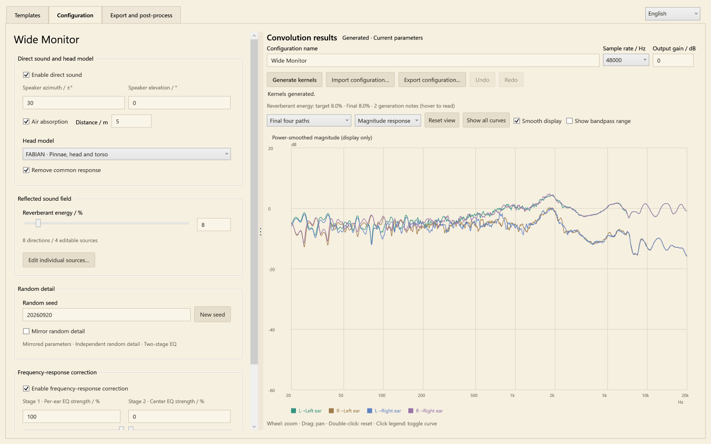
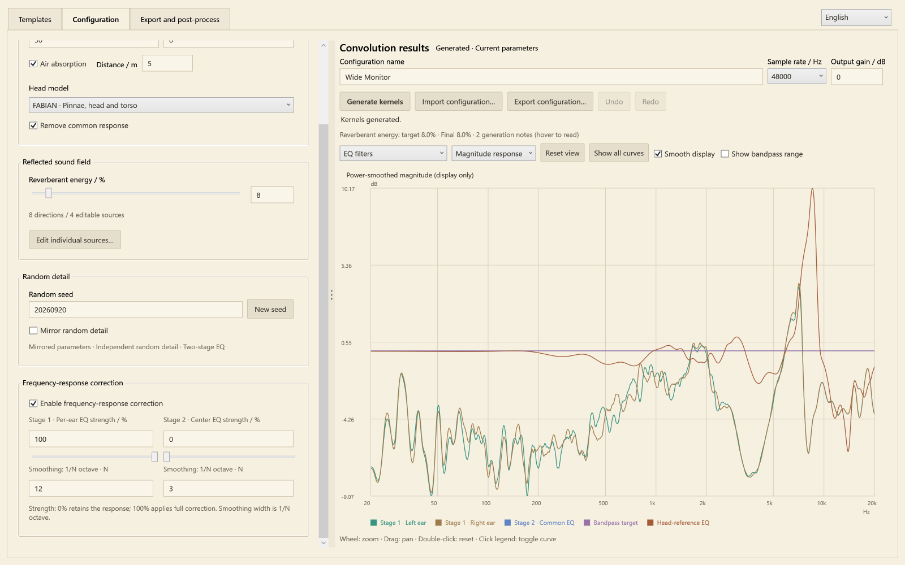
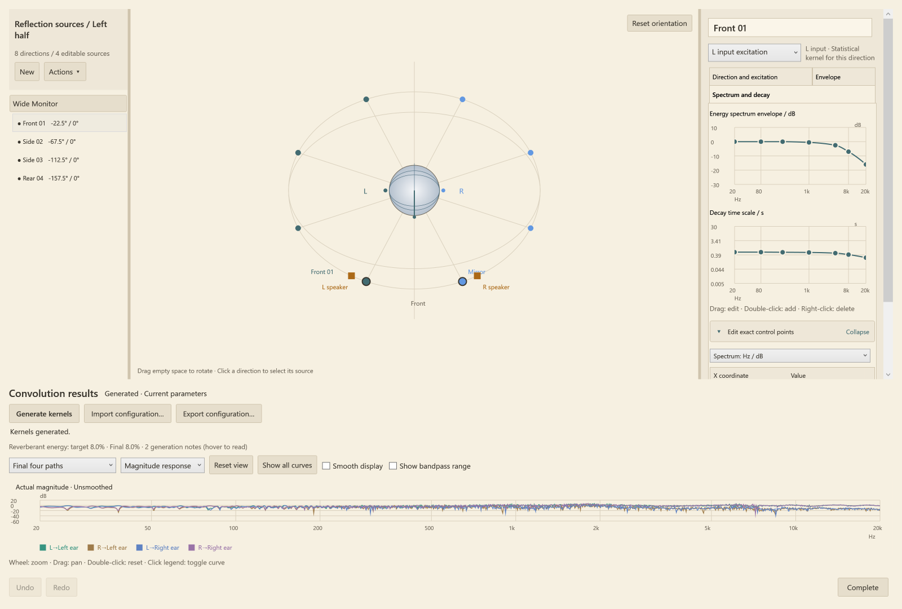
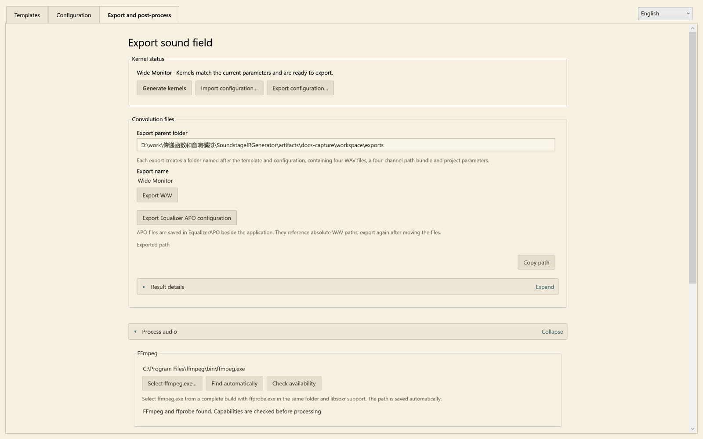
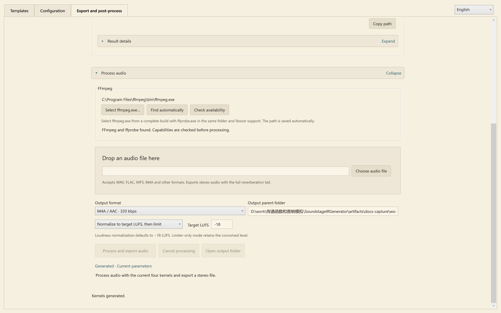

# User guide

[简体中文](../zh-CN/guide.md) · [Home](../../README.en.md) · [Reading the analysis plots](analysis.md) · [Signal model](design.md)

Soundstage IR Generator creates a four-path convolution matrix for headphone playback. Begin with a template, shape the field, generate its kernels, then export them to Equalizer APO or render a stereo audio file.

[Get started](#get-started) · [Template editing](#shape-the-template) · [Configuration](#configure-and-generate) · [Individual sources](#edit-individual-sources) · [Plots](#read-and-interact-with-the-plots) · [Export](#export-and-routing) · [Audio files](#song-rendering)

## Get started

Extract the complete Windows portable folder into a writable location and run `SoundstageIRGenerator.exe`. The download includes the .NET runtime. Kernel generation and WAV/APO export are ready to use; song rendering additionally uses FFmpeg.

Choose **English** at the top right. Without a saved manual preference, startup follows the system UI language: Simplified Chinese on Chinese systems and English on other systems. Manual changes are saved in `settings/language.json` and take priority on later launches; simply opening the application does not save a language preference. Switching language updates pages, template descriptions, plots and result details while preserving parameters and generated kernels. The selector is temporarily disabled while processing.

User-defined configuration names, source names and paths stay as written. Built-in templates created in English receive English default names. A configuration JSON works in either language, so an imported project can retain Chinese names in the English interface.

| Page | What to do there |
|---|---|
| **Templates** | Pick a starting field and open its shared parameter editor |
| **Configuration** | Set direct sound, head processing, wet balance, randomness and EQ; generate and inspect kernels |
| **Export and post-process** | Export WAV/APO files or process a song using the current result |



For a first listen, select **Wide Monitor**, leave its parameters at their defaults, and click **Confirm and generate kernels**. The application opens Configuration and computes the result. Then select Export and post-process and export the APO configuration.

## Shape the template

Click a template card to open its parameter dialog. **Confirm** loads the settings without starting computation; **Confirm and generate kernels** loads and computes them. **Cancel** keeps the existing project.

Return to Templates and choose **Edit current template…** whenever you want to adjust the shared controls again. The three curves act on the template's reflection sources together, allowing broad edits without visiting every direction.



### Three curves with different jobs

| Control | Meaning | A useful adjustment |
|---|---|---|
| **Energy spectrum / dB** | Broad integrated-energy contour of the reflected kernels | Lower the upper-frequency region for a darker reflected field |
| **Decay time scale / s · By frequency** | Tail time scale at each frequency | Shorten high-frequency tails while retaining lower-frequency decay |
| **Complete energy envelope / dB** | Local mean energy across onset, buildup and decay | Make the early section fall quickly into a quieter tail, or build it more gradually |

Drag curve points to edit, double-click to add a point, and right-click to remove one. **Edit exact control points** provides numerical editing. Frequency curves use logarithmic frequency coordinates and shape-preserving interpolation. The decay slider moves the overall time scale while retaining frequency ratios within the editing bounds; **Reset scale** restores the multiplier.

The energy and decay curves are related by synthesis, but each describes a different property. Extending the decay redistributes a band's target energy over more time; it does not automatically increase total reflected energy. The global **Reverberant energy / %** controls the balance against direct sound.

### Distance-based timing

**First-reflection excess path / m** is additional travel relative to the direct reference. Divide it by 343 m/s to obtain the relative onset time: 0.343 m means 1 ms. **Density build-up path / m** sets the scale over which the reflection density develops. The energy envelope during that interval can rise, stay level or fall.

Use **Build-up** to inspect the beginning of the envelope and **Full range** for its tail. The envelope's distance axis is an equivalent accumulated path, not the radius of a physical room. **Air absorption distance / m** separately controls direct-sound spectral loss when enabled.

Decay editing spans 0.005–30 s; excess and buildup paths span 0–3430 m; air-absorption distance spans 0–10000 m. Values outside the supported editing range are clamped. Larger values can produce much longer kernels.

### Direction distribution and downstream edits

Choose a horizontal ring, sphere, hemisphere, front sector or mirrored pairs. Direction count, orientation and coverage shape the distribution; **Generate directions** applies it. Templates use a small set of directions; the generator accepts even counts from 2 to 32. A median-plane direction is represented once.

Confirming changes to the shared curves or distribution regenerates the downstream sources. Reopening and confirming without changing those settings preserves individual-source edits. **Undo** on Configuration can restore the project before a confirmed template edit.

## Configure and generate



The settings and result plot share a draggable divider. Wide windows place them side by side; narrower windows stack them. Generation controls stay with the plot: **Configuration name**, **Sample rate / Hz**, **Output gain / dB**, **Generate kernels**, and JSON import/export.

Parameter changes leave the previous plot visible and mark it as outdated. Click **Generate kernels** to update it. The export page reports whether the result is missing, outdated, being generated or ready. WAV, APO and audio processing all use that same generated result.

### Direct sound and head model

**Speaker azimuth / ±°** controls the mirrored left/right speaker pair; **Speaker elevation / °** sets its elevation. Built-in templates use ±30° speakers. **Enable direct sound** includes their head-filtered direct responses.

**FABIAN · Pinnae, head and torso** supplies measured directional responses. **Remove common response** applies the dataset's inverse common transfer function. The spherical model supplies a simpler head-shadow and arrival-time alternative, with its own radius and shadow controls. The head model processes both the speakers and reflected directions.

Direct **Air absorption** uses the specified distance to color the direct spectrum. This distance does not add inverse-distance gain or a bulk propagation wait. The displayed time origin follows the reference ipsilateral direct peak; exported kernels retain their common lead-in and relative ear timing.

### Reflected energy

**Reverberant energy / %** targets `Ewet / (Edry + Ewet)` after head processing, final EQ and band limiting. The reference is independent, equal-power inputs over 20 Hz–20 kHz, summed over both ears; dry/wet interference terms are excluded from this component ratio. At 25%, wet/dry energy is 1/3.

Individual source gains set relative weights. Making every source −6 dB instead of 0 dB leaves the final field unchanged at the same wet target. Use relative differences to favor some directions, and the percentage to set the total reflected share.

The generator predicts how final EQ changes component energy and solves for one broadband wet gain. It applies that scalar to the whole reflected field, preserving directional weights, spectral shapes, phases and envelopes. Results report the target and achieved fraction. With direct sound disabled, the displayed fraction is locked to 100%; re-enabling it restores the requested value.

### Random detail and symmetry

Keep **Random seed** fixed for controlled comparisons. **New seed** changes the fine random realization. Ordinary edits retain other sources' random detail; seeds and stable source IDs are saved in the project.

Source parameters are always mirrored with L/R excitation exchanged. **Mirror random detail** controls whether the paired random realizations also mirror sample for sample. It defaults off. FABIAN anatomy remains mirrored in either case. Strict random mirroring uses a shared first-stage EQ; independent mirror detail allows separate per-ear correction and the common second stage.

### Frequency-response correction



**Enable frequency-response correction** controls the correction chain. FABIAN's common head-power calibration precedes the adjustable tonal stages. [The signal-model chapter](design.md#head-models-and-the-common-response) explains how this differs from the dataset's common-response removal.

| Control | Default | What it changes |
|---|---:|---|
| **Stage 1 · Per-ear EQ strength / %** | 100 | Correction of each ear's smoothed response to identical L/R inputs |
| Stage 1 **Smoothing: 1/N octave · N** | 12 | Width of the power smoothing used to design stage 1 |
| **Stage 2 · Center EQ strength / %** | 0 | Common correction based on the complex average of the two stage-1-corrected ear responses |
| Stage 2 **Smoothing: 1/N octave · N** | 3 | Width of the power smoothing used to design stage 2 |

Enter the denominator: 12 means 1/12 octave, while 3 means 1/3 octave. Larger denominators retain finer detail. Strength scales the correction in dB; 0% bypasses that stage. With strict random mirroring, stage 2 is unused.

All paths share the final scalar output calibration. Different input correlations still produce different spectra through the matrix; the individual paths are not each flattened independently. The [response examples](analysis.md#individual-paths-and-combined-responses) show the distinction. Strong correction, finite-length error and remaining smoothed deviation are reported under **Result details**.

## Edit individual sources

Select **Edit individual sources…** on Configuration to open the detailed editor. The left list represents the editable half; the direction view shows the complete mirrored field. Click a direction to select it, or drag empty space to rotate the view. **Reset orientation** restores the view.



Choose the L or R excitation in the source editor. Automatic R excitation inherits L timing, with relative gain and spectral tilt; manual mode exposes its full parameters. L and R random realizations are independent by default, as are different directions. For one direction and one input, the same kernel feeds both ear filters, preserving their shared excitation.

Use the source list and **Actions** menu for multi-selection, parameter copying and deletion. Copying parameters preserves target directions and assigns independent random detail. Source-level changes can be inspected before the head or after it using the plot subject selector. **Complete** closes the editor and retains edits in the project. Generate again to update the final result.

## Read and interact with the plots

Choose the **subject** first, then the **plot type**. For example, select **Final per-ear response to identical inputs** and **Magnitude response** to inspect the stage-1 reference after processing.

| Subject | Signal shown |
|---|---|
| **Final four paths** | The four finished kernels exported to WAV |
| **Final per-ear response to identical inputs** | Complex L/R input-path sums at each ear after correction |
| **Per-ear response to identical inputs before EQ** | The corresponding pre-EQ sums |
| **Four direct-sound paths** | Direct-path component before the final spatial EQ |
| Selected source before/after head processing | The selected source's excitation kernels or its ear paths, before final output correction |
| EQ filters | Head calibration, stage 1, stage 2 and bandpass responses |

| Plot type | What to look for |
|---|---|
| **Magnitude response** | Individual path spectra or the selected combined reference |
| **Impulse response** | Relative arrivals and tail structure around the shared time origin |
| **Energy decay** | Backward-integrated remaining energy, normalized for each displayed kernel |
| **Unwrapped phase** | Unwrapped phase with the common lead-in removed |
| **Group delay** | Frequency-dependent phase slope, also with the common lead-in removed |

Wheel to zoom, drag to pan, and double-click the plot or choose **Reset view** to reset. Click a legend entry to toggle a curve; double-click or use the context menu to isolate it. **Show all curves** restores the complete set.

**Smooth display** changes only the drawn magnitude curve, using the stage-1 smoothing width; it does not modify or regenerate the kernels. **Show bandpass range** extends the magnitude view down to 5 Hz and −100 dB. Turning it off restores the normal 20 Hz–20 kHz view. The 20 Hz and 20 kHz frequencies are inside the bandpass target's passband.

The illustrated [analysis chapter](analysis.md) walks through actual output spectra, decay curves and a time-frequency view. A kernel's file duration, a decay control and a measured RT estimate describe different things.

## Export and routing



**Export configuration…** saves editable JSON parameters and seeds. It works before generation. **Export WAV** saves calculated impulse responses to **Export parent folder**. **Export Equalizer APO configuration** creates an `EqualizerAPO/` subfolder beside the application with the four WAVs and their routing file.

Folders use readable template/project names and a timestamp. Renaming updates output names; name-only edits keep the kernel samples. Repeated exports use counters such as `_02` rather than overwriting existing results. Paths and result text can be selected and copied; **Copy path** and **Copy result details** provide complete copies.

### Four files, two output ears

The suffixes state **input → ear**. The four-channel bundle uses this order:

| Bundle channel | WAV suffix | Meaning |
|---:|---|---|
| 1 | `L_to_LeftEar.wav` | L input → left ear |
| 2 | `R_to_LeftEar.wav` | R input → left ear |
| 3 | `L_to_RightEar.wav` | L input → right ear |
| 4 | `R_to_RightEar.wav` | R input → right ear |

The bundle is named `Matrix_PATHS_LL_RL_LR_RR.wav`. It is a matrix path package, not a conventional four-speaker recording. For the four mono files, the output equations are:

```text
Left ear  = L * L_to_LeftEar  + R * R_to_LeftEar
Right ear = L * L_to_RightEar + R * R_to_RightEar
```

Here `*` is convolution. WAV output is IEEE float32 at 44.1, 48 or 96 kHz. Use every path with its original relative gain and timing.

### Equalizer APO

Include the generated `<name>_Equalizer_APO_Config.txt` file in your own APO configuration. Its temporary channels are assigned from L/R, convolved separately, then replaced into the two output channels:

```text
Copy: LL=L LR=L RL=R RR=R
# Each temporary channel is convolved with its matching WAV.
Copy: L=LL+RL R=LR+RR
```

The exported file contains all four Channel/Convolution sections and absolute WAV paths. The last Copy replaces L/R with the processed sums; an additional unprocessed copy is unnecessary. Match the device sample rate to the kernels. If files are moved, export again to obtain correct paths.

Keep the headphone EQ you normally use as the playback reference; the spatial kernels already contain their own field correction and bandpass. **Output gain / dB** and playback gain let you manage level. Result details include measured frequency peaks and a conservative transient bound; these are different from the common energy/reference calibration.

## Song rendering

Open **Export and post-process → Process audio** to produce an ordinary stereo song with the current sound field baked in.



1. Click **Select ffmpeg.exe…** and choose a complete FFmpeg build containing `ffprobe.exe` in the same folder and supporting libsoxr. Selection checks the tools; **Check availability** checks them again. [FFmpeg downloads](https://ffmpeg.org/download.html) lists available builds.
2. Drop an audio file into the panel or use **Choose audio file**. Mono and stereo input are supported, including WAV, FLAC, MP3 and M4A.
3. Choose **Output format**, **Output parent folder** and a level-processing mode.
4. Click **Process and export audio**. The input is resampled to the kernel rate, convolved, and exported with its complete tail. The input file is retained.

The application remembers the selected FFmpeg location in `settings/audio-tools.json`, separately from project JSON. **Find automatically** clears the explicit path and checks nearby `tools/ffmpeg/`, `%ProgramFiles%/ffmpeg/bin/` and `PATH`. The portable download uses your chosen FFmpeg installation.

| Level mode | Behavior |
|---|---|
| **Normalize to target LUFS, then limit** | Measures convolved loudness, applies fixed gain toward the target (default −18 LUFS), then performs linked stereo limiting |
| **Keep convolved level; limit peaks only** | Omits the loudness-normalization gain and limits peaks |
| **Bypass: raw convolution output** | Exports the unmastered convolution result; float32 WAV can retain levels beyond integer full scale |

Output choices are float32 WAV, 24-bit FLAC and AAC/M4A. Encoding or peak management can affect the finished level; the final loudness and true peak are measured and recorded in `render.json`. Loudness gain is written into the samples, rather than depending on ReplayGain tags.

A rendered song already contains the spatial effect. Play it with duplicate spatial convolution disabled; personal headphone EQ can remain active.

## Template reference

These values describe the authored starting fields. Individual directions can have different energy, decay and envelope curves. The 1 kHz tail reference is not a measured whole-kernel RT60.

| English template name | Directions | Layout | 1 kHz tail reference / s | Wet energy / % |
|---|---:|---|---:|---:|
| Compact Monitor | 6 | Ring | 0.20 | 8 |
| Wide Monitor | 8 | Ring | 0.56–0.78 across directions | 8 |
| Frontal Space | 6 | Front sector | 0.24 | 9 |
| Warm Surround | 12 | Ring | 0.55 | 28 |
| Bright Short Hall | 8 | Sphere | 0.48 | 32 |
| Overhead Surround | 12 | Hemisphere | 0.62 | 24 |
| Control Room | 8 | Sphere | 0.22 | 5 |
| Free Field | 0 | Direct only | — | 0 |
| Gentle Concert Hall | 12 | Sphere | 1.35 | 65 |
| Long Hall | 12 | Sphere | 2.30 | 80 |
| Blank Template | 0 | Add your own directions | — | Actual 0 until reflections are added |

Built-in templates use FABIAN with common-response removal, independent mirrored random detail, stage 1 at 100% / 1⁄12 octave and stage 2 at 0% / 1⁄3 octave. Wide Monitor is the author's everyday starting point and includes 5 m of direct-sound air absorption. Default source data are rounded to readable values; user-entered precision is retained in editing and JSON.

## Saving and returning to a project

Save with **Export configuration…**, then use **Import configuration…** to continue editing later. The JSON stores curves, directions, head settings, EQ, source identities and seeds. Generate after loading to recreate the field.

The writable portable folder holds `projects/`, `exports/`, `EqualizerAPO/`, `processed-audio/` and local `settings/`. Keep the complete application folder together. For a reproducible comparison, share the configuration JSON along with the application version, headphone setup and changes you made.
