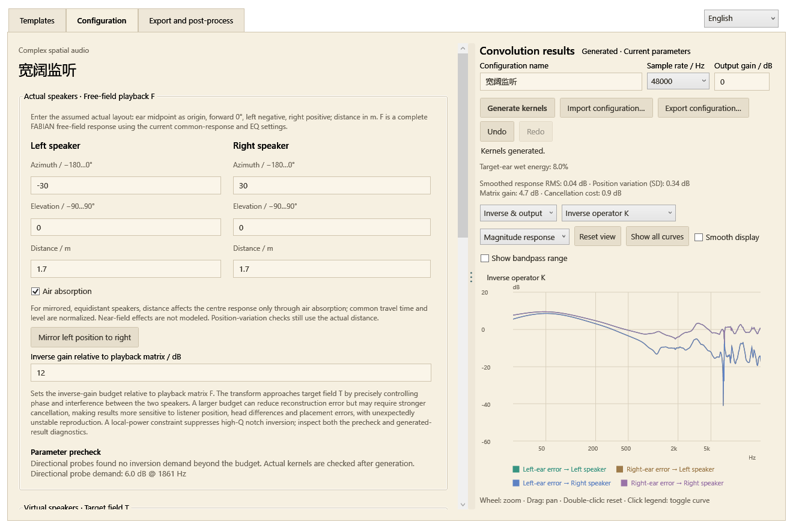

# Loudspeaker edition

[简体中文](../zh-CN/speakers.md) · [Home](../../README.en.md)

`SoundstageSpeakers.exe` offers **Simple reverb** and **Complex spatial audio**. Choose a mode at startup, then use the same template, configuration, analysis and export interface as the headphone application. Chinese and English are available at the top right.

## Simple reverb

For general loudspeaker sound coloration.

Two kernels feed the left and right loudspeakers. Edit energy spectra, frequency-dependent decay and complete envelopes. Linked parameters retain independent random detail. Wet energy is calibrated after EQ; disabling direct sound produces fully wet output.

## Complex spatial audio: F × C ≈ T

For users who can precisely control speaker placement and accept the FABIAN head approximation.

- **Actual speakers / free field F:** a complete binaural free-field convolution response generated for the entered playback geometry.
- **Virtual speakers / target T:** the ordinary headphone response generated from the virtual speakers, reflection sources and EQ settings.
- **Transform C:** four exported loudspeaker-drive kernels, solving F × C ≈ T with a common causal delay.

Both F and T use the original calibration/output chain: enabled incoherent head-power correction, per-ear smoothed minimum-phase EQ, common EQ, bandpass and common level calibration. F uses FABIAN with the current common-response and EQ settings at a 0 dB output reference. T uses the selected head model, EQ and output level.

F is the software's **calibrated free-field reference**. A successful software cascade validates its relationship to T; actual loudspeaker, listener and room transfer functions are assessed through listening or measurement.

### Actual versus virtual positions

Virtual speakers define the desired scene. Actual speakers define playback to compensate. Use the midpoint between the ears as origin: forward 0°, left negative, right positive, elevation positive upward. Enter speaker-to-ear-midpoint distance in metres.

Confirm the template to enter configuration, then edit actual speakers, virtual speakers and head settings in that order before generating. Complex-mode template dialogs offer confirmation without immediate generation.

Actual-speaker air absorption is enabled by default and uses each speaker's distance. Playback uses far-field FABIAN directional responses without near-field correction. For mirrored, equidistant speakers, common travel time and level are normalized; distance affects the centre response only through air absorption. With air absorption off, the centre response is independent of that common distance. Unequal distances retain relative 1/r levels and travel delays. Fixed-pose checks still use the actual geometry.

The relative inverse-gain setting controls the transform budget. Inversion relies on precise phase interference: increasing the budget may reduce reconstruction error while requiring stronger cancellation, making reproduction unexpectedly sensitive to listener position, head differences and placement errors.

### Plot groups

Complex-mode plots are grouped into Comparison, Inverse & output, Actual speakers, Target field and Reflection source. The default compares the target with the reconstructed result.

**Inverse & output → Inverse operator K** displays the regularized operator actually used in C = I + K(T − F), including the head, air absorption and calibration in the playback reference. Magnitude, phase and group delay come from the recorded solver coefficients. This frequency-domain operator is shown before causal projection, so impulse and decay plots are unavailable for this selection. **Output C** shows the four kernels actually exported.

Keep virtual speaker angles close to actual speaker angles. Large differences may require extreme cancellation and produce extreme responses or substantial reconstruction errors. This guidance is visible beside the virtual angle controls.

### Precheck and generated-result checks

Editing complex-mode parameters automatically runs directional unit-impulse probes. Demand beyond the inverse budget, coincident speaker paths or very close distances turns the actual-speaker group and its explanation red. This checks geometry and target directions without generating long random reverberation.

Position checks use seven fixed poses: centre, lateral/fore-aft offsets of ±5 cm, and yaw of ±5°. C and centre calibration stay fixed. With independent equal-power L/R input, each ear’s power response is smoothed over 1/3 octave. The dB standard deviation across poses is combined as an RMS across ears and logarithmically spaced frequencies into the position-variation reference value. There are no position-range controls.

Red result panels appear beside the plots and on the export page. The import guide and metadata.json retain the results:

| Metric | Warning threshold |
|---|---|
| Actual drive-matrix maximum singular-value gain, including common and differential inputs | Above 18 dB |
| Cancellation cost: summed separate-speaker contribution power / combined power, smoothed over 1/3 octave | Above 12 dB |
| Relative complex reconstruction error | Above −15 dB |
| Smoothed tonal RMS error relative to target | Above 1 dB |
| Causal projection residual | Above −50 dB |
| Frequency-response standard deviation across fixed poses | Above 3 dB |

These are engineering notification thresholds. The position standard deviation measures response dispersion across fixed poses, including natural head-motion effects. It is not a localization-accuracy score or a guaranteed listening area. Checks preserve normalization and do not automatically attenuate the output.

### Solver

At each frequency, remove the common scale s = √(‖F‖²_F / 2), defining A=F/s and B=T/s:

`C = I + (AᴴA + λI)⁻¹Aᴴ(B − A)`

The correction fades towards zero at extremely low out-of-band energy. Identical F and T produce identity; the common output bandpass is not separately inverted into large boosts. λ combines the inverse-gain budget and a 1/6-octave local constraint on weakest singular-value power, reducing narrow-notch inversion. Complex phase is retained. Projection residual determines the common causal delay, displayed with the actual result. For example, the default Wide monitor validation produced 341.33 ms; account for the displayed delay when using the kernels with video or live audio.

## Analysis and workflow

Templates → Configuration and generation → Export and post-processing. Detailed reflection sources open in a separate window. Generate beside the plots, or regenerate on the export page. Parameter changes mark existing output as stale until regeneration.

Complex mode defaults to an overlay of target T and cascade F × C L/R responses. Other subjects include output C, target paths, cascade paths, free field F and F's EQ stages. Actual output samples drive magnitude, impulse, energy-decay, phase and group-delay plots, with zoom, pan and clickable legends. Rapid switches cancel obsolete analysis; changing a subject does not recursively rebuild its selector.

## Export and comparison

Simple mode exports two mono WAVs. Complex mode exports four mono paths and a four-channel path bundle, ordered as L → Left speaker, R → Left speaker, L → Right speaker, R → Right speaker. For ordinary speaker playback, import the main file containing `Equalizer_APO_Config` / `Equalizer_APO配置`.

Complex exports also contain `name_Cascade_Test.txt`. **For a headphone software-cascade comparison, import this file alone.** It applies C first, then F. The exact F kernels are in `FreeField_Reference`. Do not also enable the main C configuration. Matrix order matters: C followed by F implements F × C.

Configuration paths are absolute: keep the export directory in place and match device sample rate. Offline song processing uses output C, with external FFmpeg selection, −18 LUFS plus limiting, limiting only or original-level float WAV.

## Model references

- [FABIAN database paper](https://doi.org/10.17743/jaes.2017.0033)
- [Duda and Martens: distance-effect background (near-field correction is not enabled in this playback model)](https://www.ece.ucdavis.edu/cipic/wp-content/uploads/sites/12/2015/04/cipic_JASA_Nov_1998.pdf)
- [Two-loudspeaker crosstalk cancellation](https://3d3a.princeton.edu/document/121)
