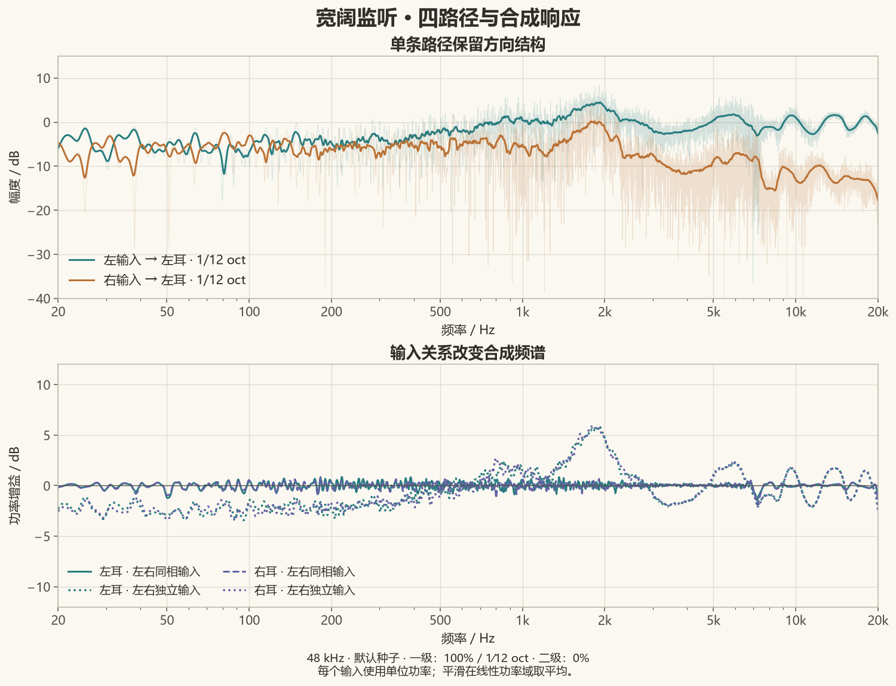
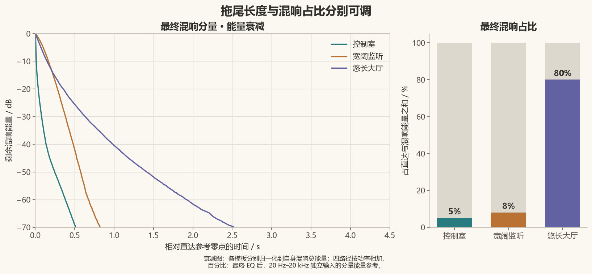
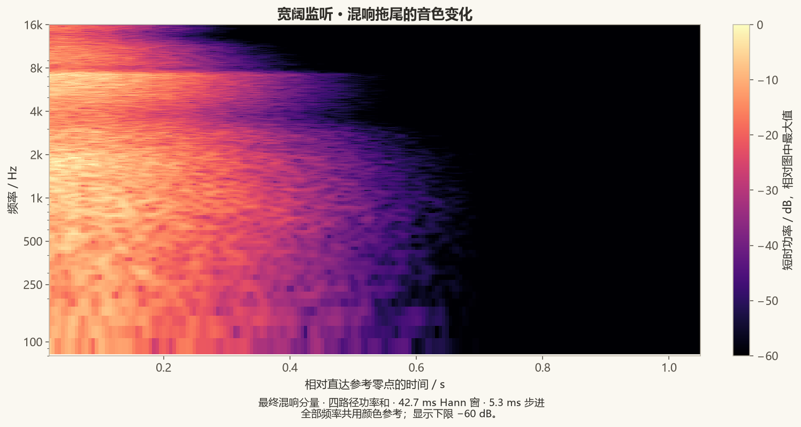

# 怎样读卷积核的分析图

[English](../en/analysis.md) · [首页](../../README.md) · [使用指南](guide.md) · [设计与信号模型](design.md)

下面的图由 4.13.0 实际生成的卷积核计算，展示方向频响、输入相关性、混响占比和衰减之间的关系。均使用内置模板、48 kHz、随机种子 `20260920`、FABIAN 与共同频响补偿；一级 EQ 为 100%、1/12 倍频程，二级为 0%。[分析元数据](../images/analysis-metadata.json)记录了结果和文件哈希。

## 单条路径与合成响应



只看左耳，将左输入到左耳的路径记为 A，右输入到左耳的路径记为 B，左耳输出就是 `A L + B R`。上图的浅线来自未经平滑的 FFT，深色线为线性功率域的 1/12 倍频程平滑。跨侧路径的高频更弱，单条路径保留方向结构。

下图比较相同四路径矩阵的两种激励方式，每个输入的功率均以 1 为基准：

| 输入关系 | 左耳输出功率 |
|---|---|
| 左右同相且相同 | `\|A+B\|²` |
| 左右独立、等功率 | `\|A\|²+\|B\|²` |

前者保留相位产生的交叉项；后者的交叉项在统计平均下为零。因此两组曲线本来就可以不同。一级 EQ 使用的是**每耳在左右同相输入下的平滑响应**，不是分别把四条路径拉平。二级 EQ 则根据一级校正后双耳复响应的平均设计共同修正；它没有从音乐中提取独立中置音源。

软件中可选择“最终四路径”查看方向响应，选择“最终每耳同相输入响应”查看合成参考。图中的独立输入曲线为额外离线计算示例。不同音乐的左右相关性不同，因此 EQ 强度对听感的影响也可以不同。

## 拖尾长度与混响占比



左图只取最终混响分量，将四路径样本平方相加，从末尾反向积分，再除以该模板的混响总能量。于是每条能量衰减曲线都从 0 dB 开始，展示的是剩余能量比例：

```text
EDC(t) = 10 log10 [t 之后剩余的混响能量 / 混响总能量]
```

这种各自归一化会隐藏模板之间的绝对干湿差异，所以右图另外列出最终混响占比：控制室 5%、宽阔监听 8%、悠长大厅 80%。占比来自生成器的 20 Hz–20 kHz 独立等功率输入、双耳合计参考，排除干湿交叉项；不是响度百分比，也不是所有歌曲都保持不变的比例。

### 文件长度、衰减参数与拟合值

| 模板 | 最终文件长度 | 宽带混响 T20 外推值 | 最终混响占比 |
|---|---:|---:|---:|
| 控制室 | 1.725 s | 0.171 s | 5.00% |
| 宽阔监听 | 2.749 s | 0.698 s | 8.00% |
| 悠长大厅 | 8.702 s | 1.259 s | 80.00% |

文件长度还包含校正滤波器的时间支持和极小电平的末端。模板的“衰减时间尺度”描述各频带的包络参数。这里的 T20 是对最终混响宽带 EDC 的 −5 至 −25 dB 区间拟合斜率，再外推到下降 60 dB 所需的时间。三者不必相等。

自定义包络、不同频率的衰减以及很弱的长尾都会影响这些量。表中的外推值描述这几条生成结果的宽带衰减。拟合优度保存在元数据中。调整时，EDC 用于看下降过程，包络曲线用于改变形状，混响占比用于控制相对直达声的总能量。

## 混响音色随时间变化



此图只包含最终混响分量，使用 2048 点 Hann 窗、256 点步进，即约 42.7 ms 窗长和 5.3 ms 步进。四路径的短时功率相加，全部频率共用同一个颜色参考。高频后段变暗，表示高频混响能量更早减少，不是每个频率单独归一化后的视觉效果。

能量频谱决定某个频段累计分到多少能量；衰减时间尺度决定这些能量怎样分布在时间上。较弱的长高频尾巴和较强的短高频尾巴是两种不同结果。人头处理和最终 EQ 也会影响图中频谱。

这个窗长适合看拖尾总体变化。直达峰和最初几毫秒应看软件里的“脉冲响应”。

## 相位与群延迟怎么看

“展开相位”和“群延迟”扣除了共同直达参考的前导时间，仍保留各路径之间的差异和拖尾自身的时间结构。将它们与幅度和脉冲图配合使用：脉冲图看时域到达，衰减图看持续程度，相位和群延迟图用于比较同一路径的变化。

干涉深谷附近的群延迟是局部相位斜率，不必对应一条独立反射的到达时刻。生成器保留统计核自身的幅相结构；最小相位描述的是校正滤波器，整个混响拖尾没有被重建成最小相位脉冲。

## 图片与计算来源

代码版本为 `42c782826e9fd68503345deae77885837203f291`（4.13.0）。使用指南中的中英文界面图由该版本的 WPF 控件离屏渲染。分析读取 `GenerationResult.Kernels` 和 `FinalReflectionPaths` 的 float32 样本，最终四路径与 WAV 导出的样本、顺序一致。

频响来自补零到下一次幂长度的 FFT；平滑先在线性功率域对 `f × 2^(±1/24)` 区间积分并取平均，再转为 dB。相干参考先做复数求和；独立参考先求各路径功率和。EDC 使用完整混响样本反向积分。时频图显示 80 Hz–16 kHz，颜色下限 −60 dB。

比较自己的配置时，可以固定随机种子、保存 JSON，每次修改后重新生成，并使用相同的图表对象和显示方式。
