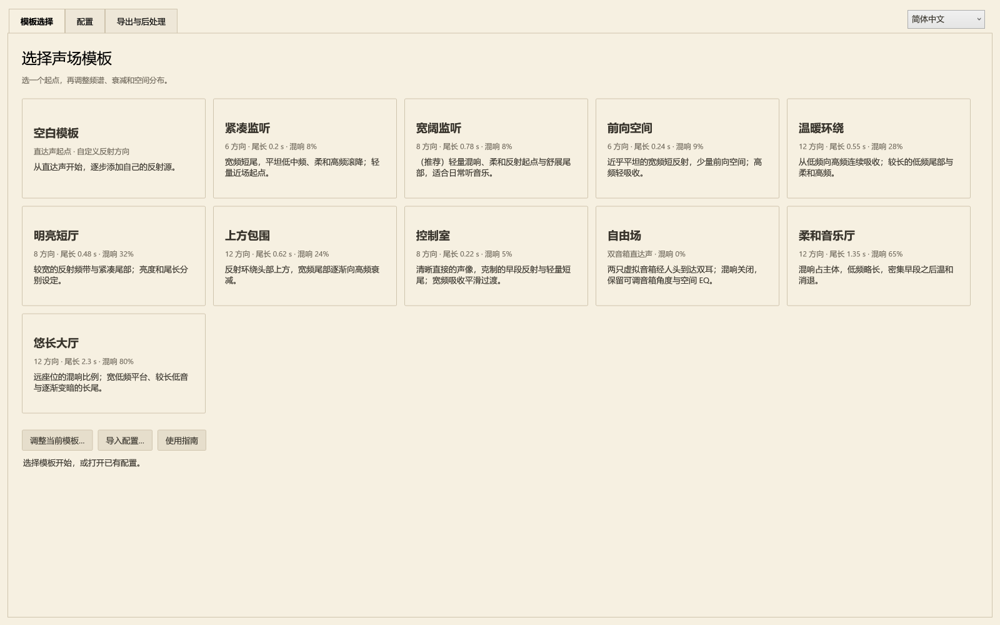
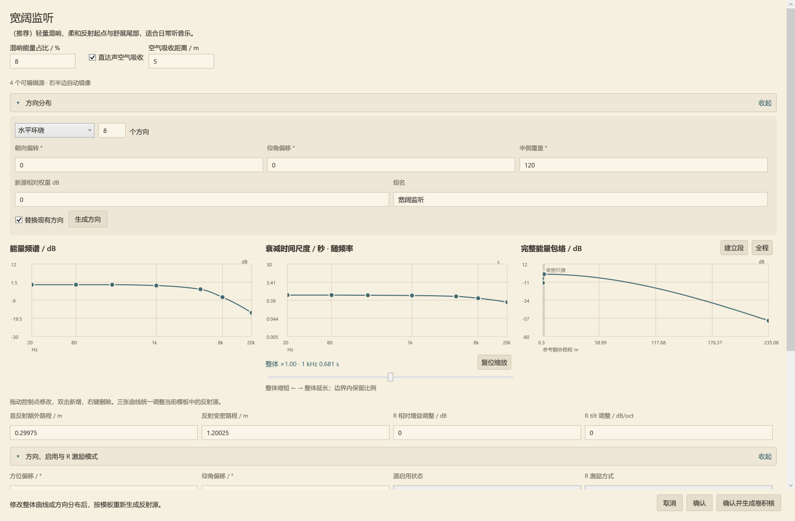
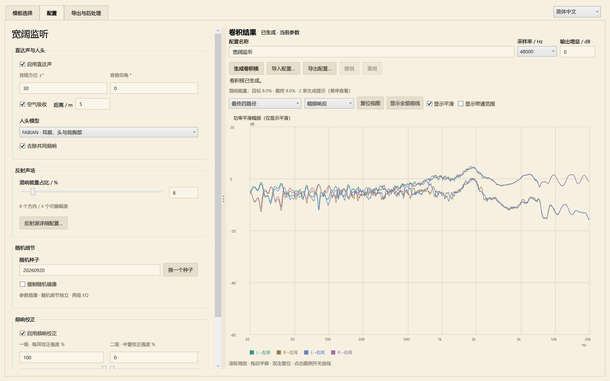
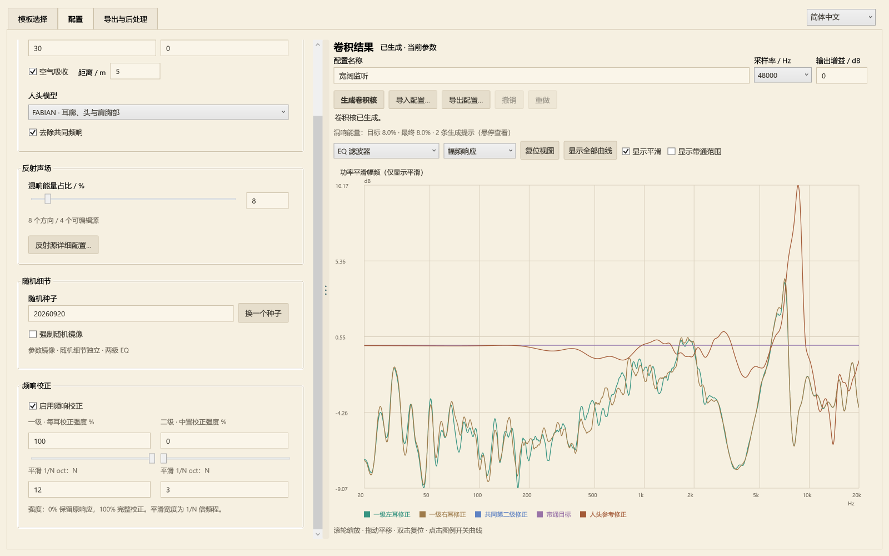
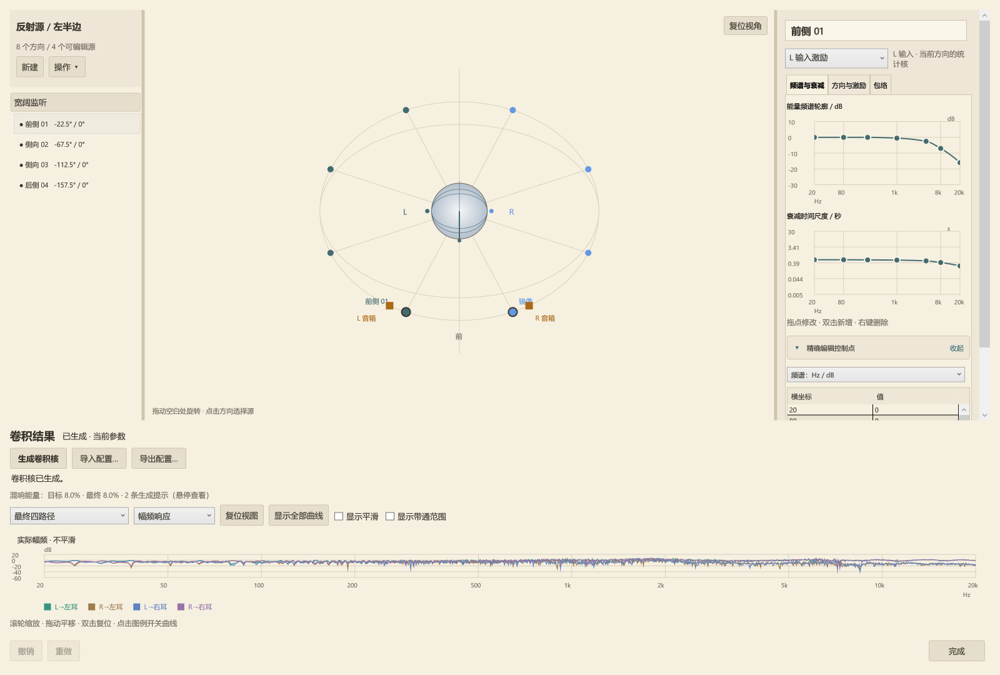
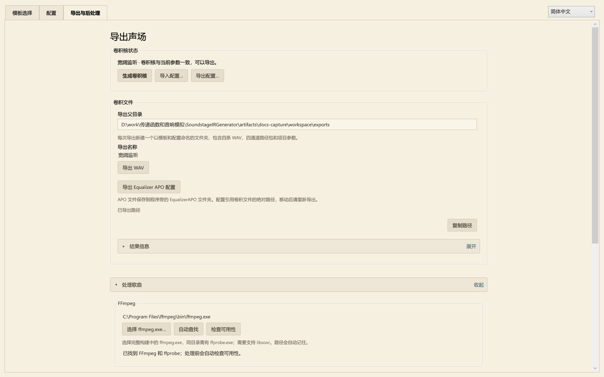
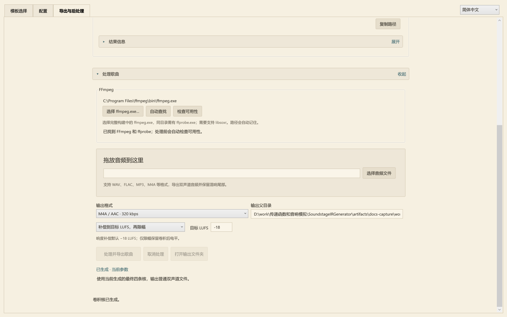

# 耳机空间音效与 HRTF 卷积核使用指南

[English](../en/guide.md) · [回到首页](../../README.md) · [怎样读卷积核分析图](analysis.md) · [设计与处理链](design.md)

Soundstage IR Generator 为耳机回放生成四路径卷积矩阵。从模板出发，调整声场，生成卷积核，然后导出给 Equalizer APO，或直接处理一首双声道歌曲。

[开始使用](#开始使用) · [模板调整](#调整模板) · [配置与生成](#配置与生成) · [逐源编辑](#编辑单个反射源) · [图表](#查看与操作图表) · [导出](#导出与路由) · [处理歌曲](#处理歌曲)

## 开始使用

下载 Windows x64 发布包，将**整个文件夹**解压到有写权限的位置，运行 `SoundstageIRGenerator.exe`。发布包包含 .NET 运行时；生成卷积核、导出 WAV 和 APO 配置可以直接使用。处理歌曲还需要 FFmpeg。

窗口右上角可以切换“简体中文”和“English”。首次启动时，中文系统使用简体中文，其他系统使用英文；之后采用 `settings/language.json` 保存的选择。切换语言会更新页面、模板介绍、图表和结果说明，保留当前参数与卷积结果。处理过程中语言选择暂时禁用。

配置名、反射源名和路径保持用户填写的内容。英文界面从内置模板建立配置时使用英文默认名称；导入中文命名的项目后，名称仍然保留。中英文界面使用相同的 JSON 配置格式。

| 页面 | 在这里做什么 |
|---|---|
| **模板选择** | 选择声场，打开整体参数编辑窗口 |
| **配置** | 调整直达声、人头、混响比例、随机细节和 EQ；生成并分析卷积核 |
| **导出与后处理** | 导出 WAV、APO 配置，或用当前结果处理歌曲 |



第一次试听可以选择“宽阔监听”，保留默认参数，点击**确认并生成卷积核**。程序进入配置页并计算结果；完成后自行切换到“导出与后处理”，导出 Equalizer APO 配置。

## 调整模板

点击模板卡片打开参数窗口。**确认**载入参数；**确认并生成卷积核**在载入后开始计算；取消保留原项目。需要返回调整时，在模板选择页点击**调整当前模板…**。



### 三条曲线各管什么

| 控制项 | 含义 | 调整示例 |
|---|---|---|
| **能量频谱 / dB** | 反射核在各频段的整体能量轮廓 | 降低高频部分，让反射声更暗 |
| **衰减时间尺度 / s · 随频率变化** | 各频段拖尾的时间尺度 | 缩短高频尾巴，同时保留低频衰减 |
| **完整能量包络 / dB** | 从起始、建立到衰减的局部平均能量 | 让早段快速下降到较弱长尾，或渐渐建立 |

拖动控制点编辑，双击增加点，右键删除点；精确控制点编辑区可以直接填数字。频率曲线使用对数频率轴和保形插值。**整体衰减时间倍率**改变整体长短，同时在参数范围内保留各频段比例；复位倍率恢复乘数。

能量与时间通过合成过程关联，但含义不同。延长某频段的衰减，是把目标能量分配到更长时间，不会自动增加其总能量。与直达声的总比例由配置页的**混响能量占比 / %**控制。

### 用路程表达时间

**首反额外路程 / m**是相对直达参考的额外传播路程。除以声速 343 m/s 就是起始延时：0.343 m 对应 1 ms。**反射变密路程 / m**控制建立段和反射密度变化的尺度；这一段的能量可以上升、持平或下降。

包络图可以切换建立段和完整范围。横轴表示等效累计路程，不是房间半径。直达声的**空气吸收距离 / m**另管空气造成的频率损耗，只有启用空气吸收才生效。

衰减编辑范围为 0.005–30 s，额外路程与变密路程为 0–3430 m，空气吸收距离为 0–10000 m。超出支持范围的值会钳位；更长的参数可能生成更长的卷积核。

### 方向分布与逐源细调

方向模板包括水平环绕、球形、半球、前向扇区和镜像成对分布。调整数量、朝向和覆盖范围后，使用方向生成按钮应用；支持 2–32 个方向的偶数数量，对称面上的方向只保留一份。

修改整体曲线或方向分布并确认，会向下重新生成反射源。重新打开模板后，保持这些设置不变并确认，会保留逐源细调。配置页的**撤销**可以恢复确认模板前的项目。

## 配置与生成



设置区和图表区之间可以拖动调节比例。较窄窗口改为上下排列。**配置名称、卷积核采样率、输出增益、生成卷积核、导入配置、导出配置**都位于结果图旁。

修改声学参数后，已有图表继续显示，同时标记结果待更新。点击**生成卷积核**重新计算。导出页会显示尚未生成、参数已修改、正在生成或可导出；WAV、APO 和歌曲处理使用同一份生成结果。

### 直达声与人头

音箱方位角控制左右镜像音箱的夹角，仰角控制高度方向。内置模板采用 ±30°。**启用直达声**决定是否保留两只虚拟音箱的直达路径；**空气吸收**按指定距离改变直达声频谱。

空气吸收距离不直接施加距离衰减或整段传播等待。图表零点采用同侧直达参考主峰，导出文件记录共同前导样本并保留相对到耳时差。

- **FABIAN**：使用测量的人头、耳廓和躯干响应；内置模板默认采用它。
- **球形头**：使用简化头部遮挡与到耳延时，可调整相应头部参数。
- **去除共同频响**：移除 FABIAN 数据中跨方向共有的频响轮廓，保留方向之间的差异。

FABIAN 还包含固定的边缘带宽延伸与非相干人头功率校准。它们与上述共同频响开关的作用见[人头处理说明](design.md)。

### 混响能量占比

**混响能量占比 / %**的目标是最终人头处理、EQ 和带通之后的 `Ewet / (Edry + Ewet)`。参考输入为 20 Hz–20 kHz 内左右独立、等功率的平坦功率谱，对两耳累计；干湿交叉项不计入这个分量比例。25% 对应混响能量与直达能量之比为 1/3。

反射源电平用于分配相对权重。所有源统一 −6 dB，与统一 0 dB，在同一混响目标下得到相同的归一化声场。用源之间的差异调方向，用总百分比调干湿。

生成器预估 EQ 带来的能量偏移，求解一个共同的宽带混响增益。所有反射方向、输入和频段共享这个标量，保留相对权重、频谱形状、相位与包络。结果报告目标和最终占比。关闭直达声时，界面占比锁定为 100%；重新启用后恢复原设定。

### 随机细节与对称

对比参数时保持**随机种子**不变；更换种子会改变随机细节。普通参数修改保留其他源的随机实现，稳定源 ID 和种子随 JSON 保存。

源参数始终左右镜像，并交换 L/R 激励。**强制随机镜像**只决定成对源的随机实现是否逐样本镜像，默认关闭。无论这个开关如何，FABIAN 的头部解剖响应都采用镜像处理。严格随机镜像时使用共同一级 EQ；关闭时允许左右耳分别校正，再进行共同二级校正。

### 频响校正



**启用频响校正**控制校正链路；FABIAN 人头功率校准先于可调的两级音色校正。

| 参数 | 默认值 | 作用 |
|---|---:|---|
| 一级：单耳 EQ 强度 / % | 100 | 修正每耳在 L/R 同相输入下的平滑响应 |
| 一级平滑分母 N | 12 | 一级校正使用 1/12 倍频程功率平滑 |
| 二级：中置 EQ 强度 / % | 0 | 根据一级校正后两耳复响应的平均，设计共同校正 |
| 二级平滑分母 N | 3 | 二级校正使用 1/3 倍频程功率平滑 |

输入的是分母：12 表示 1/12 oct，3 表示 1/3 oct；分母越大，保留的频谱细节越多。强度按 dB 比例缩放修正量，0% 旁路该级。严格随机镜像时不使用二级。

最终四路径使用共同标量做输出标定，不逐条独立拉平。不同输入相关性仍会得到不同频谱；[频响图解](analysis.md)给出实际例子。强校正、有限长度误差和剩余平滑偏差会出现在**结果信息**里。

## 编辑单个反射源

在配置页点击**反射源详细配置…**打开独立编辑窗口。列表对应可编辑的半边参数，方向图显示完整镜像声场。点击方向选择源，拖动空白区域旋转视图，使用复位朝向恢复视角。



选择 L 或 R 激励进行编辑。自动 R 继承 L 的时间参数，通过相对增益与频谱 tilt 改变能量；手动模式则提供完整参数。同一方向的 L/R 激励默认使用独立随机实现，不同方向也默认独立。同一方向、同一输入的核同时送到两耳的人头滤波器，保留共同激励关系。

源列表与操作菜单支持多选、参数复制和删除。复制参数保留目标方向，并分配独立随机细节。图表可以检查所选源的人头前激励或人头后路径。点击**完成**关闭窗口并保留编辑；重新生成后更新最终结果。

## 查看与操作图表

先选择分析**对象**，再选择**图型**。例如选最终单耳同相响应和幅频响应，可以检查校正后的一级参考。

| 分析对象 | 展示内容 |
|---|---|
| 最终四路径 | 实际导出为 WAV 的四条核 |
| 最终单耳同相响应 | 校正后，每耳的 L/R 输入路径复数相加 |
| EQ 前单耳同相响应 | 对应的校正前合成响应 |
| 直达声四路径 | 最终空间 EQ 之前的直达分量 |
| 所选源的人头前／后响应 | 对应的激励核或到耳路径，尚未做最终输出校正 |
| EQ 滤波器 | 人头校准、一级、二级与带通目标 |

| 图型 | 观察内容 |
|---|---|
| 幅频响应 | 单条路径频谱，或选定合成参考 |
| 冲激响应 | 共同时间零点附近的到达与拖尾结构 |
| 能量衰减 | 反向积分的剩余能量，每条曲线分别归一化 |
| 展开相位 | 扣除共同前导后的展开相位 |
| 群延迟 | 同样扣除共同前导的相位斜率 |

滚轮缩放，拖动平移，双击绘图区或点击**复位视图**恢复。点击图例切换曲线，双击或右键菜单独看某条，**显示全部曲线**恢复所有曲线。

**显示平滑**只改变绘出的幅频曲线，使用一级平滑宽度，不改变或重新生成卷积核。**显示带通范围**将幅频范围扩展到 5 Hz 起、低至 −100 dB；关闭恢复常用的 20 Hz–20 kHz。20 Hz 与 20 kHz 位于带通目标的通带内。

调整窗口大小期间使用缩放预览，松开后恢复清晰图表。图表操作复用已分析的结果。完整的[卷积核图解](analysis.md)进一步说明路径频谱、衰减曲线和时频图，以及文件长度、衰减参数、测得 RT 之间的区别。

## 导出与路由



**导出配置…**保存参数与种子的 JSON，无需先生成。**导出 WAV**将卷积核写入指定导出父目录。**导出 Equalizer APO 配置**在程序旁的 `EqualizerAPO/` 下建立独立文件夹，包含四条 WAV 和路由文件。

文件夹使用可读的模板／配置名称和时间戳。修改配置名会更新输出名称；单纯改名保留核样本。重名导出使用 `_02` 等序号，避免覆盖。路径和结果文字支持选中复制；**复制路径**与**复制结果信息**可以复制完整内容。

### 四条文件，两只耳朵

名称按“输入 → 耳朵”解释。四通道路径包的固定顺序如下：

| 打包通道 | WAV 后缀 | 含义 |
|---:|---|---|
| 1 | `L_to_LeftEar.wav` | 左输入 → 左耳 |
| 2 | `R_to_LeftEar.wav` | 右输入 → 左耳 |
| 3 | `L_to_RightEar.wav` | 左输入 → 右耳 |
| 4 | `R_to_RightEar.wav` | 右输入 → 右耳 |

路径包名为 `Matrix_PATHS_LL_RL_LR_RR.wav`，用于矩阵路由。四条单声道文件的组合为：

```text
左耳 = L * L_to_LeftEar + R * R_to_LeftEar
右耳 = L * L_to_RightEar + R * R_to_RightEar
```

`*` 表示卷积。WAV 为 IEEE float32，支持 44.1、48、96 kHz；使用时保留各路径的相对电平与时差。

### Equalizer APO

将导出的 `_APO.txt` Include 到自己的 APO 配置。路由先从 L/R 复制临时声道，分别卷积，再赋值回输出：

```text
Copy: LL=L LR=L RL=R RR=R
# 中间由导出文件提供四组 Channel / Convolution 指令。
Copy: L=LL+RL R=LR+RR
```

最后的 Copy 用处理后的和替换 L/R，无需另加原始干声。导出文件包含完整绝对 WAV 路径；移动文件后重新导出。设备采样率应与卷积核一致。

保留自己习惯的耳机 EQ 作为回放参考。空间核已经带有声场校正与带通；**输出增益 / dB**和播放音量用于管理电平。结果信息里的频点峰值、保守瞬态上界，与共同能量／参考标定是不同指标。

## 处理歌曲

打开**导出与后处理 → 处理歌曲**，把当前声场直接写入普通双声道音频文件。



1. 点击**选择 ffmpeg.exe…**，选择完整 FFmpeg 构建；同目录需有 `ffprobe.exe`，构建需支持 libsoxr。选择后检查可用性，也可以手动重新检查。[FFmpeg 下载页](https://ffmpeg.org/download.html)列出可用构建。
2. 拖入歌曲，或点击选择音频文件。支持单声道和双声道，以及 WAV、FLAC、MP3、M4A 等格式。
3. 选择输出格式、输出父目录和电平处理模式。
4. 点击处理并导出。输入会重采样到核的采样率，经过矩阵卷积，输出包含完整拖尾；输入文件保留。

FFmpeg 路径保存在 `settings/audio-tools.json`，与声场 JSON 分开。**自动查找**清除明确指定的路径，搜索程序旁 `tools/ffmpeg/`、`%ProgramFiles%/ffmpeg/bin/` 与 `PATH`。

| 电平模式 | 处理方式 |
|---|---|
| 归一化到目标 LUFS 后限幅 | 测量卷积后响度，施加固定增益接近目标（默认 −18 LUFS），再做双声道联动限幅 |
| 保留卷积电平，仅限制峰值 | 省略响度归一化增益，限制峰值 |
| 旁路：原始卷积输出 | 输出未经响度和限幅处理的结果；float32 WAV 可保留超过整数满刻度的样本 |

输出包括 float32 WAV、24-bit FLAC、AAC/M4A。编码和峰值处理可能影响最终电平；成品响度与真峰值会重新测量，记录在 `render.json`。响度增益直接写入样本，不依赖 ReplayGain 标签。

处理好的歌曲已含空间效果。播放时关闭重复的空间卷积；个人耳机 EQ 可以继续使用。

## 模板参考

以下是内置起点，各方向可以有不同能量、衰减与包络。1 kHz 尾长参考是参数，不是整条核的实测 RT60。

| 模板 | 方向数 | 分布 | 1 kHz 尾长参考 / s | 混响能量 / % |
|---|---:|---|---:|---:|
| 紧凑监听 | 6 | 水平环绕 | 0.20 | 8 |
| 宽阔监听 | 8 | 水平环绕 | 各方向 0.56–0.78 | 8 |
| 前向空间 | 6 | 前向扇区 | 0.24 | 9 |
| 温暖环绕 | 12 | 水平环绕 | 0.55 | 28 |
| 明亮短厅 | 8 | 球形 | 0.48 | 32 |
| 上方包围 | 12 | 上半球 | 0.62 | 24 |
| 控制室 | 8 | 球形 | 0.22 | 5 |
| 自由场 | 0 | 仅直达声 | — | 0 |
| 柔和音乐厅 | 12 | 球形 | 1.35 | 65 |
| 悠长大厅 | 12 | 球形 | 2.30 | 80 |
| 空白模板 | 0 | 自行添加方向 | — | 添加反射源前实际为 0 |

内置模板采用 FABIAN 并去除共同频响，关闭强制随机镜像，一级为 100% / 1⁄12 oct，二级为 0% / 1⁄3 oct。宽阔监听是作者的日常起点，包含 5 m 直达空气吸收。默认源参数采用易读的小数；用户自己填写的精度在编辑和 JSON 中保留。

## 保存与继续编辑

使用**导出配置…**保存 JSON，之后通过**导入配置…**继续调整。配置保存曲线、方向、人头设置、EQ、稳定源标识和随机种子；载入后重新生成即可重建声场。

可写的便携目录中包含 `projects/`、`exports/`、`EqualizerAPO/`、`processed-audio/` 和本机 `settings/`。保留完整程序文件夹。分享可复现的对比时，提供配置 JSON、程序版本、耳机回放设置和修改项即可。
