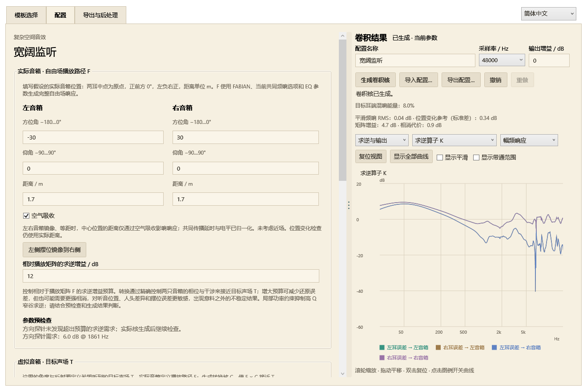

# 音箱版

[English](../en/speakers.md) · [首页](../../README.md)

发布目录中的 `SoundstageSpeakers.exe` 提供“简单混响”和“复杂空间音效”。启动时选择模式，随后使用与耳机版相同的模板、配置、图表和导出界面。窗口右上角可切换中文与英文。

## 简单混响

适合一般的音响染色任务。

左右两条核分别送入左右音箱，编辑能量频谱、随频率变化的衰减和完整包络。联动参数时，左右仍有独立的随机细节。生成后校准混响能量占比；关闭直达声得到全混响。

## 复杂空间音效：F × C ≈ T

适合能够严格控制音响摆位，并接受 FABIAN 头部近似的用户。

- **实际音箱／自由场 F**：按输入的实际摆位生成完整的自由场双耳卷积响应。
- **虚拟音箱／目标 T**：按虚拟音箱、反射源和 EQ 设置，生成普通耳机版的目标响应。
- **转换核 C**：导出给音箱播放的四条核，使 F × C 尽量接近 T，允许共同的因果延迟。

F 和 T 都使用原生成器的校准与输出链路，包括启用的人头非相干功率校正、每耳平滑最小相位 EQ、共同 EQ、带通和共同电平标定。实际播放参考使用 FABIAN，沿用当前共同频响补偿和 EQ 设置，输出基准为 0 dB；目标 T 使用界面选择的人头、EQ 和输出电平。

这里的 F 是软件约定的**校准后自由场参考**。软件串联吻合验证的是这套参考与目标的关系；真实音箱、人头和房间的传递函数需要通过实际试听或测量评估。

### 两套音箱位置

“虚拟音箱”控制希望听到的声场；“实际音箱”控制需要补偿的播放路径。实际摆位以两耳中点为原点，正前方为 0°、左负右正、仰角向上为正，距离填写音箱到两耳中点的米数。

模板确认后进入配置页，按实际音箱、虚拟音箱、人头设置的顺序编辑，再生成卷积核。复杂模式模板弹窗只提供确认，不直接生成。

实际音箱默认启用空气吸收，以各自距离计算。采用远场 FABIAN 方向响应，不做近场修正。镜像等距时，共同传播延时与电平归一化，中心响应的距离影响仅来自空气吸收；关闭空气吸收后，这种摆位的中心响应不随距离改变。不等距时保留 1/r 相对电平与传播时差；固定位置检查仍使用真实几何距离。

相对播放矩阵的求逆增益控制转换预算。求逆依靠精确的相位干涉；增大预算可能减少还原误差，也可能增加相消需求，使听音位置、人头差异及摆位误差更容易造成意料之外的不稳定结果。

### 图表分组

复杂模式的图表按结果对照、求逆与输出、实际音箱、目标声场、反射源分组。默认显示目标与还原结果对照。

“求逆与输出 → 求逆算子 K”显示求解器实际采用的正则化算子，记录的是 C = I + K(T − F) 中的 K，包含播放路径中人头、空气吸收及自由场校准的影响。幅频、相位和群延迟来自求解时的系数；该频域算子尚未因果化，因此此选项不提供冲激和衰减图。“输出核 C”展示实际导出的四条卷积核。

建议虚拟音箱角度接近实际音箱角度。相差过大可能需要极强相消，导致极端响应或明显还原误差；角度编辑区域直接显示该提示。

### 参数预检查与生成检查

修改复杂模式参数后自动进行方向单位冲激探针检查；超出求逆预算、重合摆位或极近距离会将实际音箱设置框与原因标红。预检查不合成长混响核，估计的是几何与目标方向的难度。

位置检查使用七个固定采样点：中心、左右／前后各偏移 5 cm、左右转头各 5°。保持 C 及中心位置的校准滤波器不变，以独立等功率 L/R 激励计算各采样点的每耳功率频响，做 1/3 oct 平滑后，计算位置间的 dB 标准差，再在双耳与对数频率上取 RMS，得到“位置变化参考值”。没有位置范围设置项。

生成后的红色提示位于图表旁和导出页，导出说明与 metadata.json 同样保存结果：

| 指标 | 当前提示阈值 |
|---|---|
| 实际驱动矩阵最大奇异值增益，含同相与差分输入 | 高于 18 dB |
| 相消代价：两箱单独贡献的功率和／合成后功率，1/3 oct 平滑 | 高于 12 dB |
| 相对复响应重建误差 | 高于 −15 dB |
| 平滑频响相对目标的 RMS 偏差 | 高于 1 dB |
| 因果化投影残差 | 高于 −50 dB |
| 固定位置采样的频响标准差 | 高于 3 dB |

这些是工程提示阈值。位置标准差用于比较同一套固定核随位置变化的频响离散程度，包含正常的人头位置变化；它不是声像定位准确度或保证有效的听音范围。检查结果不改变归一化，也不会自动调小音量。

### 求解

在每个频率用 s = √(‖F‖²_F / 2) 去掉共同尺度，令 A=F/s、B=T/s，求解：

`C = I + (AᴴA + λI)⁻¹Aᴴ(B − A)`

带外极低能量处，修正项平滑趋向零。相同 F 和 T 得到单位通路，共同带通不会变成独立求逆的大增益。λ 同时包含求逆增益预算及最弱奇异值功率的 1/6 oct 局部约束，降低窄谷的精确追补。保留复相位，按投影残差确定共同延迟。界面中的延迟来自实际生成结果。例如，默认宽阔监听的验证结果为 341.33 ms；用于视频或实时音频时，需要考虑结果中显示的延迟。

## 图表与工作流程

选择模板 → 配置并生成 → 导出与后处理。详细反射源编辑在独立窗口内；生成按钮位于图表旁，导出页也可重新生成。修改参数后，旧结果显示过期，重新生成后可导出。

复杂模式默认显示“目标 T 与串联 F × C”的双耳合成响应对比，也能查看输出 C、目标 T、串联结果、自由场 F 及 F 的 EQ 各阶段。分析采用实际输出核，支持频响、脉冲、能量衰减、相位、群延迟、缩放、平移和图例开关。快速切换时过期分析被取消，图表选择不会重复重建自身。

## 导出与对照试听

简单模式导出两条单声道 WAV；复杂模式导出四条单声道路径及四通道路径包，顺序为 L → 左音箱、R → 左音箱、L → 右音箱、R → 右音箱。常规音箱播放导入名称含 `Equalizer_APO配置`／`Equalizer_APO_Config` 的主文件。

复杂模式另提供 `名称_Cascade_Test.txt`：**用耳机做软件串联对照时，单独导入这个文件**。它按 C → F 顺序运行，F 的确切四条核位于 `FreeField_Reference` 子目录。不要同时再启用主配置，否则会重复处理。矩阵处理顺序必须保持，C → F 对应 F × C。

配置内使用绝对 WAV 路径，请保持导出目录位置；播放采样率与文件一致。歌曲离线处理使用输出 C，支持外部 FFmpeg、−18 LUFS 加限幅、仅限幅及原始电平浮点 WAV。

## 模型依据

- [FABIAN 数据库论文](https://doi.org/10.17743/jaes.2017.0033)
- [Duda 与 Martens：距离效应背景（本版播放模型未启用近场修正）](https://www.ece.ucdavis.edu/cipic/wp-content/uploads/sites/12/2015/04/cipic_JASA_Nov_1998.pdf)
- [双音箱串扰消除研究](https://3d3a.princeton.edu/document/121)
